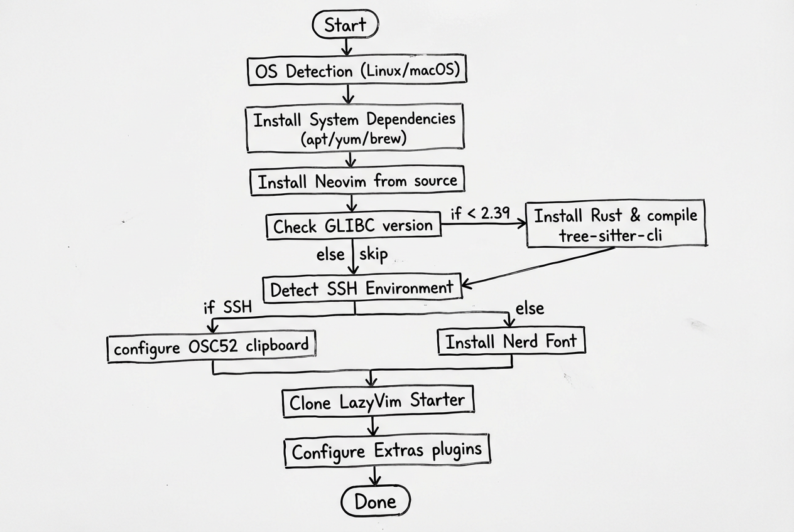
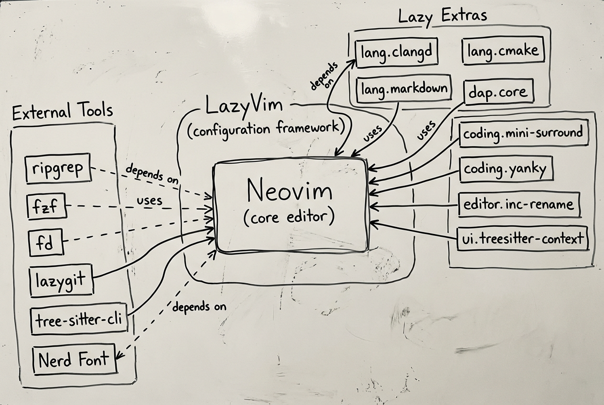

# LazyVim 安装项目


> 一键安装 LazyVim 的完整解决方案，开箱即用

[](https://opensource.org/licenses/MIT)
[](https://github.com/LazyVim/starter)

## 项目简介

一个专为 LazyVim 设计的完整安装解决方案，安装后即可直接开始编码：

- **自动安装脚本** - 一键安装所有依赖和插件
- **开箱即用** - 预装 C/C++、Python、Go、Java、TypeScript、Tailwind CSS、Markdown 语言支持和常用插件
- **SSH 友好** - 自动检测 SSH 环境并配置剪贴板互通
- **GLIBC 兼容** - 自动处理低版本 GLIBC 的 tree-sitter 兼容性问题
- **系统检查工具** - 验证安装是否成功

## 快速开始

```bash
git clone https://github.com/corner430/lazyvim-installer.git
cd lazyvim-installer
chmod +x install-lazyvim.sh
./install-lazyvim.sh
```

手动安装请参考 [LazyVim-Installation-Guide.md](./LazyVim-Installation-Guide.md)。

### 安装流程



## 预装插件



安装脚本会自动启用以下 Lazy Extras：

| 分类 | 插件 | 说明 |
|------|------|------|
| 语言 | `lang.clangd` | C/C++ 支持（clangd LSP + 补全、跳转、诊断） |
| 语言 | `lang.cmake` | CMake 支持 |
| 语言 | `lang.python` | Python 支持（pyright + ruff + debugpy） |
| 语言 | `lang.go` | Go 支持（gopls + goimports + gofumpt + delve） |
| 语言 | `lang.java` | Java 支持（jdtls + java-debug-adapter） |
| 语言 | `lang.typescript` | TypeScript/JavaScript 支持（vtsls + js-debug-adapter） |
| 语言 | `lang.tailwind` | Tailwind CSS IntelliSense（类名补全、颜色预览） |
| 语言 | `lang.json` | JSON 支持（json-lsp） |
| 语言 | `lang.markdown` | Markdown 支持 + marksman LSP + 远程预览 |
| 调试 | `dap.core` | DAP 调试框架 |
| 编码 | `coding.mini-surround` | 括号/引号包围操作 |
| 编码 | `coding.yanky` | 增强复制粘贴 |
| 编辑器 | `editor.inc-rename` | 实时重命名预览 |
| UI | `ui.treesitter-context` | 顶部显示当前函数/类名 |

## SSH 剪贴板互通

在 SSH 环境下，安装脚本会自动配置 [OSC52](https://github.com/ojroques/nvim-osc52) 协议，使 `yy` 等复制操作可以同步到本地剪贴板。

> **注意：** 安装器会将 `vim.opt.clipboard` 设为 `""`（空字符串），而非 `"unnamedplus"`。这是因为 SSH 环境下没有系统剪贴板 provider，设为 `unnamedplus` 会导致 OSC52 不生效。

**需要你的本地终端支持 OSC52：**
- iTerm2、WezTerm、Alacritty、Windows Terminal、kitty
- macOS Terminal.app **不支持**
- tmux 需在 `~/.tmux.conf` 添加 `set -g set-clipboard on`

## Markdown 远程预览

在 SSH 环境下，`:MarkdownPreview` 默认无法打开浏览器。安装脚本会自动检测服务器 IP 并配置 markdown-preview.nvim 的远程访问：

1. 在 nvim 中打开 Markdown 文件
2. 执行 `:MarkdownPreview`
3. 在本地浏览器访问 `http://<服务器IP>:8888`

> 确保服务器防火墙放行了 8888 端口。

## 已知问题

### GLIBC 兼容性

部分 Linux 发行版（如 TencentOS、CentOS 8 等）的 GLIBC 版本低于 2.39，Mason 预编译的 `tree-sitter CLI` 会报错：

```
tree-sitter: /lib64/libc.so.6: version `GLIBC_2.39' not found
```

安装脚本会自动检测 GLIBC 版本，在低版本系统上通过 Rust 从源码编译 tree-sitter CLI。此过程会自动安装 Rust（如果尚未安装）。

## 系统要求

| 要求 | 最低版本 |
|------|----------|
| Neovim | >= 0.9.0 |
| Git | >= 2.19.0 |
| 终端 | 支持真彩色 |

推荐工具（脚本会自动安装）：Nerd Font、ripgrep、fzf、fd、lazygit、C 编译器

**语言运行时（按需安装）：**

| 语言 | 要求 | 说明 |
|------|------|------|
| C/C++ | gcc 或 clang | 脚本自动安装 |
| Python | python3 | pyright + ruff LSP |
| Go | go >= 1.21 | gopls LSP |
| Java | JDK >= 11 | jdtls LSP（首次打开 .java 时自动下载，约 300MB） |
| TypeScript | Node.js >= 18 | vtsls LSP |

## 项目结构

```
lazyvim-installer/
├── install-lazyvim.sh              # 自动安装脚本
├── check-system.sh                 # 系统检查脚本
├── LazyVim-Installation-Guide.md   # 详细手动安装指南
├── README.md                       # 本文档
└── LICENSE                         # MIT 许可证
```

## 安装后验证

```bash
chmod +x check-system.sh
./check-system.sh
```

## 许可证

MIT License - 详见 [LICENSE](LICENSE)。

## 致谢

- [LazyVim](https://github.com/LazyVim/LazyVim)
- [Neovim](https://neovim.io/)
- [Nerd Fonts](https://www.nerdfonts.com/)
- [nvim-osc52](https://github.com/ojroques/nvim-osc52)
